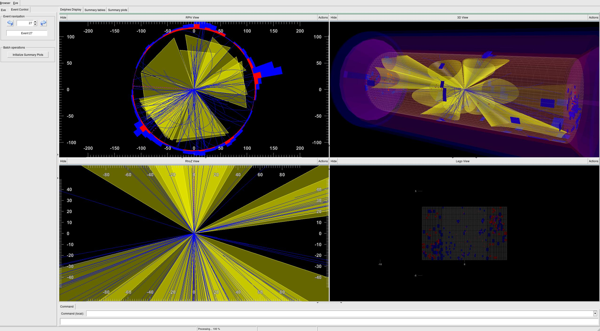

# Simulation of high energy collisions

Generation of simulated high energy collisions data using
[MadGraph](https://launchpad.net/mg5amcnlo) (hard scattering),
[Pythia](http://home.thep.lu.se/~torbjorn/Pythia.html) (showering)
and [Delphes](https://github.com/delphes/delphes) (detector fast simulation).
This requires to have [ROOT](https://root.cern/) installed.


## Setup

> **Note:** the file `setup.sh` must be adapted to **your** setup to have a ROOT version compatible with Delphes. 

1. Download MadGraph: https://launchpad.net/mg5amcnlo. Untar the archive as `MG5_aMC/` directory.

2. Install needed pythia and Delphes
```
cd MG5_aMC/
./bin/mg5_aMC
install pythia8
install Delphes
```

> **Note:** the Delphes compilation might fail if the installed ROOT version is not compatible.
> In that case, a compatible version of ROOT must be installed and Delphes can be compiled by hand,
> doing:
> ```
> cd Delphes
> ./configure
> make
> ```

3. Compile the display library of Delphes and produce `libDelphesDisplay.so`, to enable event display.
```
cd Delphes
./configure
make display
```

4. Data analysis and event display: link/load the required libraries
```
cd analysis
ln -s ../MG5_aMC/Delphes/libDelphesDisplay.so .
```


## Usage

The workflow consists in first generating the process setup (directory) with MadGraph
using a "process card". Then, the showering of events is performed with Pythia and
the detector simulation is ran with Delphes. A ROOT file is then produced which contains
different collections of objects. This ROOT file can be used to get event display or
directly distributions.

### Generate events for a process

A [python interface](generate/generation_handler.py) is designed to ease the event generation.
An [example](generate/example.py) is featuring how to generate `p p -> t tbar` and `mu mu -> t tbar`
using this python interface. There are two classes, but the first one is not mandatory:
 + `collision`: initial state (particle, energy, polarization, pdf) and final state
 + `madgraph`: running the actual event generation with several options such as pythia or delphes.


### Inspect event displays

```
root -l rootlogon.C
root[0] .x EventDisplay.C("../MG5_aMC/Delphes/cards/delphes_card_ATLAS.tcl", "delphes_events.root")
```




### Analyze events